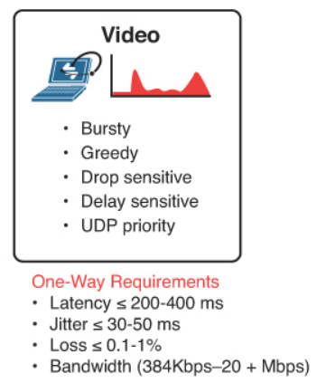

# Samtale

## Introducción
Este proyecto a consistido en el desarrollo en Python de un aplicación que permite el flujo de vídeo entre dos usuarios. Si bien Python es un gran aliado para este tipo de proyectos, como ya lo fue en el anterior, hemos encontrado más dificultades en el desarrollo de este. Procedemos a hacer una descripción de la estructura del proyecto, las decisiones de diseño más importantes y de las dificultades encontradas en el camino.

## Estructura del proyecto
El proyecto se divide en los siguientes archivos. Vamos a intentar hacer una descripción de menos complejo a más complejo.

### Decorators
En este fichero hemos implementado una serie de decoradores sumamente útiles. Destacan los siguientes:
* timeout: la función decorada con @timeout(milliseconds) se parará a los milliseconds milisegundos si no ha terminado. Aunque actualmente no lo usamos, inicialmente lo empleamos para cortar la lectura de la cámara si ésta era muy lenta, pues usábamos la función *registerEvent* de appJar. Ahora, con el modelo basado en Threads no es necesario.
* timer: esta función no la usamos tampoco en el código de develop/master pues es mayoritariamente para debuggear, ya que indica el tiempo en milisegundos que tarda una función en ejecutarse. La empleamos para estimar qué partes del código eran más lentas.
* run_in_thread: esta función la usamos extensamente para ejecutar funciones en un thread aparte y no bloquear el hilo principal.
* singleton: implementa el patrón *Singleton* usado en la clase CurrentUser.

### Configuration

En este fichero se implementa la clase Configuration. Realmente sólo debería haber una instancia de esta clase, pero como tan sólo es usada por algunos métodos de *VideoClient*, no hemos implementado el patrón *Singleton*. Esta clase expone una atributo *status*, que puede tener cuatro valores:

- LOADED: indica que se ha leído el fichero de configuración y que se ha registrado al usuario correctamente
- WRONG_PASSWORD: indica que se ha leído el fichero de configuración, pero que no se pudo registrar al usuario en el servidor
- WRONG_FILE: indica que el fichero de configuración existe pero que no se ha podido leer correctamente (porque el archivo estuviera corrupto, faltaran algunos campos, etc.)
- NO_FILE: indica que el fichero de configuración no existe

Además, dispone de un método `load` para cargar la configuración durante la ejecución del programa y un método `delete` para borrar el fichero de configuración.

### Logger

En este fichero tenemos dos funciones:

- **set_logger**: establece el formato de los mensajes de logging, estableciendo como salida *stdout* en vez del valor por defecto *stderr*.
- **get_logger:** obtiene el logger del proyecto

En el resto del ficheros imprimimos los mensajes de log de la siguiente manera:

```python
get_logger().debug("Este es un mensaje muy poco imporante")
get_logger().info("Este es un mensaje poco importante")
get_logger().warning("Este es un mensaje bastante importante")
get_logger().error("Este es un mensaje muy importante")
```


### User

Contiene las clases User y CurrentUser. La segunda hereda de la primera y añade una contraseña. Además, cabe destacar el método de User que calcula el protocolo común entre él y el CurrentUser, muy útil para determinar cual debe ser usado en una llamada. Además, la clase CurrentUser es un `Singleton`, pues la aplicación sólo puede ser usada por un usuario a la vez. Conseguimos implementar este patrón de diseño usando el decorador mencionado unas líneas más arriba. Por otro lado, contiene funciones para determinar la IP pública y privada del usuario.

### Discovery Server
Contiene todas las funciones relacionadas con el servidor de descubrimiento (para conseguir una lista de los usuarios conectados, los datos de un usuario en particular y para registrarse). Hemos tenido diversos problemas con la función LIST_USERS. En primer lugar, esta no devuelve los datos tal y como refleja la documentación, ya que en lugar de dar qué protocolos soporta un usuario, da el timestamp en el que se registró, información que no nos es útil. Sin embargo, esto lo solucionamos haciendo un QUERY de un usuario cuando vamos a llamarle para no solo tener su información actualizada (sus atributos pueden haber cambiado desde que llamamos a LIST_USERS), sino también para conocer qué protocolos soporta. Por otro lado, en ocasiones, esta función devuelve el contenido en respuestas separadas, por lo que es necesario llamar a recv varias veces. Además, no tenemos forma de saber cuando ha acabado de transmitir, ya que no acaba en ningún caracter especial. Como solución temporal y adoptando una posición probabilística, establecemos que este último carácter es '#', pero esto puede darse sin necesidad de que hayamos recibido la respuesta completa. Si en su lugar la respuesta acabase en un caracter especial, nuestro desarrollo permite una fácil adaptación.


### UDP Helper
Este módulo está dedicado a cubrir todo lo relacionado con los datagramas UDP que contienen el vídeo. Como debemos encapsular el datagrama UDP bajo una cabecera común, decidimos crear la clase `UDPDatagram`. De esta forma, tenemos tanto los datos como la cabecera integrados en un mismo objeto. Además, añadimos un método *encode* (similar al de la clase str) que permite codificar a bytes el datagrama. Esto es sumamente útil a la hora de enviarlo a través del socket.

Por otro lado, y mucho más importante, tenemos la clase `UDPBuffer`. Como su nombre indica, es el buffer que va a ir almacenando los paquetes de vídeo que van llegando. Tiene tres funciones bien diferenciadas:
* Permite la inserción ordenada de los frames que llegan por la red al buffer. Comienza intentando insertar por el final hasta que encuentra su posición. Al hacerlo, calcula la calidad estimada de la conexión basada en tres parámetros:
    * num_holes: es el número de huecos que tiene el buffer. Se le da mucha importancia al calcular el score pues no debería haber muchos huecos teniendo en cuenta que suele haber una media de BUFFER_MAX paquetes en el buffer.
    * packages_lost: histórico de paquetes perdidos. Como es una variable que refleja el número de paquetes perdidos en total, queremos darle una importancia relativa. Por ello, lo dividimos por el número de secuencia actual, que refleja el número de paquetes totales de la transmisión.
    * avg_delay: mide la media del delay. Si el delay es muy inestable o muy grande, es sinónimo de una conexión inestable. Por ello, siguiendo los valores recomendados por el libro de referencia de la asignatura, asignamos más o menos peso al score. Recordemos que estos valores hablan de que por debajo de 150 ms es excelente, entre 150 ms y 400 ms es aceptable, y más allá de esos 400 ms es inaceptable. Por las razones que comentamos más adelante finalmente no se tiene en cuenta para evitar tomar decisiones incorrectas.
    * jitter: mide la variación del retardo que experimentan los paquetes. Es una medida mucho más robusta que la anterior y no se ve afectada por la falta de sincronización entre los relojes de los distintos equipos. Por ello, decidimos sustituir el jitter por el avg_delay a la hora de calcular la calidad del buffer. Consideramos que un jitter inferior a 20ms es excelente, entre 20 y 50 es aceptable y más de 50 es inaceptable.
    
    Tras el cálculo del score, determinamos la calidad de la conexión como un valor de la enumeración `BufferQuality`. Básicamente, los número mágicos que aparecen son fruto de querer dar más importancia a unas variables que a otras y de muchas pruebas para ver que valores tenían mejor comportamiento. También, nos basamos en las [recomendaciones](https://community.cisco.com/t5/blogs-routing-y-switching/fundamentos-de-qos-calidad-de-servicio-en-capa-2-y-capa-3/ba-p/3103715) de **Cisco** a la hora de tomar estas decisiones:
    
    
    
    Cabe comentar un aspecto muy significativo en cuanto al delay. Sería una medida muy buena si los relojes de los dispositvos en la llamada estuviesen sincronizados. Sin embargo, tras realizar distintas pruebas, hemos comprobado que esto no es realmente así. Esto provoca que, en ocasiones, la medida del delay no sea un valor real y pueda llevarnos a tomar decisiones erróneas. Por ejemplo, probando con un compañero que ejecutaba en Windows, nos salía un delay medio de 600 ms, cuando la conexión era perfecta y el vídeo no sufría ningún retraso, pues a la vez estábamos haciendo una llamada de voz por Discord que informaba de un delay menor de 100ms. Es más, a Guillermo le salía que el video que enviaba Daniel tenía un delay negativo. Es por ello que finalmente no realizamos control del delay al insertar, como sugirió el profesor. De hecho, fue al probar con este compañero cuando nos dimos cuenta del problema que suponía esto, ya que inicialmente habíamos incluido una restricción de un delay menor que 400 ms para poder ser insertado en el buffer, y en este caso no se insertaba nada aunque la comunicación fuese perfecta. La línea de código que comprobaba esa condición, y que por tanto descartaba paquetes con un delay superior a 400 ms a parte de por el número de secuencia, era la siguiente:
    
    ```python
    # If datagram should have already been consumed, discard it
    if datagram.seq_number < self.__last_seq_number or datagram.delay_ts >= UDPBuffer.MAXIMUM_DELAY:
        return False
    ```
    
* Permite la extracción de frames. Inicialmente no deja consumir hasta que el buffer se haya llenado parcialmente, para tener margen de maniobra a la hora de reproducir. Además, tampoco deja consumir más rápido que `time_between_frames` (media del tiempo entre paquetes estimado con los FPS), para evitar acelerar el vídeo. Sin embargo, si detecta que el buffer se está llenando en exceso, disminuye este tiempo para consumir ligeramente más rápido y evitar retrasos mayores. Esto es fundamental porque los FPS informados no suelen correponderse con los FPS reales, ya sea por limitaciones de la propia webcam o porque se hace un sleep de 1/fps sin tener en cuenta el tiempo que se tarda en capturar, reescalar, comprimir y enviar cada frame. Al consumir, se recalcula el número de huecos que quedan en el buffer y el último número de secuencia consumido (usado para descartar paquetes anteriores a este número de secuencia).

* Avisa al hilo encargado de mostrar el vídeo por pantalla cada `time_between_frames` de que debe consumir, a través de la función `wake_displayer` que es ejecutada en un hilo aparte. Daremos más detalles más adelante, pero este hilo encargado de mostrar vídeo también es avisado por el hilo que obtiene el vídeo "local" (ya sea de la webcam o de un fichero).

### Call Control
Aquí está implementado todo lo relacionado con el control de las llamadas, tanto las que están en curso como las que pueden iniciarse (o denegarse). Para ello, tenemos un hilo que escucha permanentemente en segundo plano por el puerto de control posibles llamadas entrantes. En caso de recibir una llamada, este hilo comprueba si ya estamos en una llamada (de ser así devuelve CALL_BUSY) para notificar al usuario y preguntarle si desea aceptar la llamada. Cuando entramos en una llamada, se crea otro hilo que escucha en segundo plano en la conexión de control establecida para esa llamada controlando si llegan solicitudes de pausa, reanudación, ... y tomando las acciones pertinentes derivadas de estas solicitudes. Además, de poner en marcha estos dos hilos que escuchan en segundo plano, implementa funciones para poder mandar los mensajes de control al otro usuario. Cuando desarrollamos este módulo, fue muy importante el manejo de semáforos, ya que son varios los hilos que están operando sobre los mismos atributos y no podemos dejar que por ejemplo se pongan en marcha dos llamadas o situaciones similares. Sin embargo, tampoco podemos bloquear la aplicación si estamos esperando una llamada y volvemos a solicitar otra mientras tanto (los semáforos no bloquearían la segunda petición hasta que la primera fuese resuelta, lo que derivaba en que la aplicación se quede bloqueada mientras tanto. Con la gestión actual esto ya no ocurre). Este es un ejemplo de la importancia que han tenido los semáforos. Por último, cabe comentar que tiene unos atributos específicos de cada llamada que son reseteados cuando esta llamada llega a su fin.

### samtale.py
Este es el punto de entrada al programa y donde está implementada toda la interfaz de usuario. A grandes rasgos, nos gustaría destacar las siguientes funciones, que corren en diferentes threads:
* **receive_video**: recibe vídeo por UDP y lo introduce en el `UDPBuffer` (ver udp_helper)
* **capture_and_send_video**: captura vídeo (de la webcam o del fichero) y lo introduce en una cola thread-safe para que la función de visualización lo reproduzca. A continuación, despierta al hilo de display_video para que se reproduzca en la interfaz. Además, si estamos en una llamada mandamos el frame capturado al receptor.
* **display_video**: extrae un fotograma de la cola local y otro del `UDPBuffer` (si estamos en una llamada). Si la cola o el buffer están vacíos (o no quieren que consumamos, porque, por ejemplo, el UDPBuffer está esperando a llenarse por estar en la fase inicial), se reproducirá de nuevo el anterior frame. De estar en una llamada, la imagen del propio usuario se muestra en  una pequeña ventana abajo a la derecha. Esta función se ejecuta cuando capture_and_send_video ó wake_displayer la despiertan.

## Versión 1
Se ha desarrollado una versión extra que contiene las siguientes actualizaciones:
* CALLING incluye la versión a usar por ambos usuarios en la llamada. Esta versión es determinada por el usuario origen con la información obtenida del servidor de descubrimiento. De esta forma, evitamos que el usuario destino tenga que contactar al servidor de descubrimiento para un parámetro que ya es conocido por el origen. Además, si en algún momento futuro se diera la opción de que el usuario origen no eligiese la última versión del protocolo soportado por ambos, podría hacérselo saber al otro extremo con esta nuevaversión de CALLING. Aunque pueda parecer absurdo no usar la última versión, podría suceder, por ejemplo, que el protocolo más reciente cifrase los datos, y que el usuario origen decisiese usar un protocolo más antiguo para obtener un mayor rendimiento en detrimento de la privacidad. Además esta mejora es totalmente compatible con la versión anterior, ya que añade la versión a usar al final de la cadena mandada, luego si por un casual la versión no está bien determinada y se aplica esta funcionalidad con un usuario que solo soporta la V0, este simplemente ignorará que el mensaje es más largo y contiene más campos.
* Mejoras en control de flujo: Como durante la llamada se mantiene una conexión TCP abierta, hemos aprovechado este hecho para incorporar un nuevo mensaje de control llamado CALL_CONGESTED, que se enviara en caso de detectar una mala conexión. La principal ventaja de esto con respecto a la V0 es hacer saber al extremo emisor que la conexión en su sentido no está siendo buena. Con la V0, el receptor solo puede tomar decisiones en cuanto a lo que él envía (como cambiar la calidad de la imagen), pero quizás no haya ningún problema en su sentido (la calidad de la conexión puede ser asimétrica) y estos cambios solo los tenga que hacer el emisor. Haciéndole llegar un CALL_CONGESTED permitimos hacerle saber a la otra parte que quizás debería hacer cambios en sus envíos sin tener que cambiar cómo enviamos nosotros. La detección de la mala conexión se lleva a cabo en el `UDPBuffer` tal y como hemos comentado unas líneas más arriba al estimar la calidad. Las medidas que tomamos si recibimos un CALL_CONGESTED es reducir la resolución de la imagen que enviamos, pero los usuarios pueden reimplementarlo como prefieran. Además, puesto que las medidas excepcionales que tomemos pueden solucionar la conexión y dejar de ser necesarias, comprobamos en el Call Control si ha pasado más de CONGESTED_INTERVAL segundos desde el último CALL_CONGESTED. Si es así, probamos a desactivar las medidas excepcionales. Lo bueno de haber implementado un control sobre la calidad de lo recibido es que si no estamos en una versión superior a la V0 pero detectamos una bajada en la calidad podemos tomar las mismas medidas que tomaríamos si nos llegase un CALL_CONGESTED en nuestro extremo. Haciendo esto último estamos suponiendo que la conexión es simétrica, es decir, que si recibo los datos por una mala conexión, es porque la conexión en el otro sentido tambiés es mala y tomando medidas en nuestro extremo contribuimos a mejorar la conexión en ambos sentidos. Sin embargo, hemos podido comprobar que las conexiones son bastante asimétricas y por eso hemos implementado esta medida de aviso que es CALL_CONGESTED.

## Conclusiones
Como hemos comenzado diciendo, esta práctica ha supuesto un esfuerzo extra con respecto a lo anterior. Esto se ha debido a que para que la aplicación tenga un buen comportamiento influyen muchos factores externos que no se pueden controlar (inestabilidad de la red, ...). Además, disponíamos de poco material teórico referido al envío de vídeo en el que basar nuestras decisiones más técnicas relacionadas con el control del buffer, gestión de la reproducción (velocidad, ...). Finalmente, estas decisiones han estado basadas en material encontrado en la red, en el sentido común y en numerosas pruebas realizadas. También nos ha hecho darnos cuenta una vez más de la necesidad de ser compatibles con el resto de usuarios, siguiendo un estándar si queremos llegar a comunicarnos con nuestras diferentes implementaciones. También, hemos podido observar como factores que en teoría deberían ser exactos influyen fuertemente cuando en realidad no lo son (véase el caso de los relojes y los valores absurdos de delay).